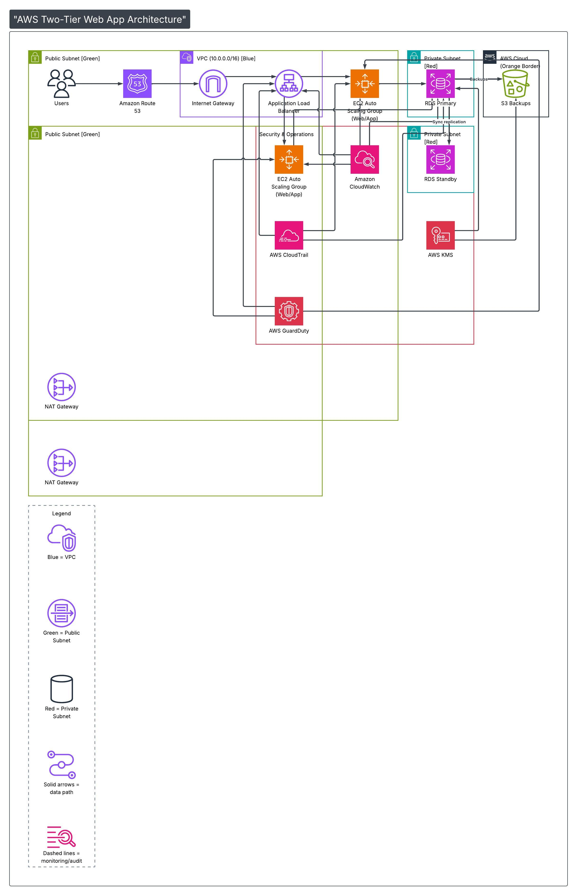

# AWS Well-Architected Framework & Cloud Adoption Framework Assessment
**Workload:** Two-Tier Web Application Migration (On-Premises → AWS)  
**Prepared by:** Cloud Architecture Team  
**Date:** February 2026

> **Navigation:** [← Back to README](README.md) | [Architecture Diagram](AWS_Two-Tier_Web_App_Architecture.jpeg)

---

## Task 1 – Existing Architecture Review

### Workload Components

The existing on-premises deployment being migrated consists of the following components, which map directly to the improved AWS architecture:

- **DNS / Traffic Entry:** Amazon Route 53 routes end-user requests to the application entry point
- **Networking:** Internet Gateway within a VPC (10.0.0.0/16) handles ingress; two NAT Gateways (one per public subnet) handle outbound traffic from private subnets
- **Web / App Tier:** An Application Load Balancer (ALB) distributes traffic across an EC2 Auto Scaling Group (Web/App) spanning two public subnets
- **Database Tier:** RDS Primary instance in a private subnet, with synchronous replication to an RDS Standby instance in a second private subnet (Multi-AZ)
- **Backup / Storage:** Automated backups from RDS Primary flow to an S3 Backups bucket in the AWS Cloud
- **Security & Operations Layer:** EC2 Auto Scaling Group (Web/App), Amazon CloudWatch, AWS CloudTrail, Amazon GuardDuty, and AWS KMS are all integrated to provide monitoring, auditing, threat detection, and encryption

### Identified Risks & Weaknesses

| Risk | Description |
|------|-------------|
| Single point of failure | Both tiers run on individual servers with no failover |
| No backup strategy | No automated database backups or application snapshots |
| Single-AZ deployment | No geographic redundancy; any data centre issue causes full outage |
| Overly permissive security groups | Assumed open inbound rules (e.g., 0.0.0.0/0 on port 22, 3306) |
| No encryption in transit or at rest | Sensitive data potentially transmitted and stored unencrypted |
| Manual deployments | No CI/CD pipeline; changes applied directly to production |
| No monitoring or alerting | No visibility into performance, errors, or security events |
| No scalability mechanism | Fixed capacity; no ability to handle traffic spikes |

---

## Task 2 – AWS Well-Architected Framework (WAF) Evaluation

### WAF Assessment Table

| Pillar | Observation | Improvement Recommendation | Supporting AWS Service |
|--------|------------|---------------------------|----------------------|
| **Operational Excellence** | **Strength:** Amazon CloudWatch is already integrated into the Security & Operations layer, providing real-time metric collection and visibility across the EC2 ASG and RDS tiers. **Weakness:** The diagram does not show a CI/CD pipeline or infrastructure-as-code tooling, meaning deployments may still be manual and environment configurations are not version-controlled. | Complement the existing CloudWatch setup with a full CI/CD pipeline and infrastructure-as-code to automate deployments and ensure repeatable, auditable environment provisioning. Establish CloudWatch dashboards with alarms tied to runbooks for automated incident response. | AWS CloudFormation, AWS CodePipeline, Amazon CloudWatch |
| **Security** | **Strength:** AWS GuardDuty (threat detection), AWS CloudTrail (API audit logging), and AWS KMS (encryption at rest for RDS) are all present in the architecture, forming a solid layered security baseline. **Weakness:** The diagram does not explicitly show AWS WAF on the ALB, nor AWS Secrets Manager for credential management — hardcoded credentials in EC2 instances remain a risk. | Attach AWS WAF to the Application Load Balancer to filter OWASP Top 10 threats before they reach the EC2 tier. Introduce AWS Secrets Manager to store and auto-rotate RDS credentials, eliminating the need for hardcoded passwords in application configuration. | AWS WAF (on ALB), AWS Secrets Manager, AWS KMS, Amazon GuardDuty, AWS CloudTrail |
| **Reliability** | **Strength:** The architecture demonstrates strong reliability foundations: RDS Primary and RDS Standby are deployed across two separate private subnets with synchronous replication, and automated RDS backups flow to S3. The EC2 Auto Scaling Group spans two public subnets across availability zones. **Weakness:** There is no explicit health-check-based failover policy shown for the EC2 tier, and the S3 backup retention and restore procedures are not defined. | Define explicit Auto Scaling health check policies and minimum instance counts (e.g., min: 2, one per AZ) to ensure the web tier remains available during instance failure. Document and test RDS failover and S3 backup restore procedures with defined RTO and RPO targets. | Amazon RDS Multi-AZ, AWS Auto Scaling, Application Load Balancer (ALB), AWS Backup, Amazon S3 |
| **Performance Efficiency** | **Strength:** The EC2 Auto Scaling Group automatically adjusts compute capacity in response to demand, and the Multi-AZ RDS setup allows for future read replica addition to offload read traffic. **Weakness:** The architecture does not show a caching layer between the application and database tiers, meaning all read requests hit RDS directly, which can degrade performance under load. | Introduce Amazon ElastiCache (Redis) between the EC2 ASG and RDS Primary to cache frequent read queries, significantly reducing database load and improving response times at scale. Use AWS Compute Optimizer to right-size EC2 and RDS instance types based on actual utilisation data from CloudWatch. | Amazon ElastiCache (Redis), AWS Compute Optimizer, Amazon CloudWatch, Amazon RDS Read Replicas |
| **Cost Optimization** | **Strength:** Auto Scaling ensures EC2 capacity scales down during off-peak periods, avoiding the fixed 24/7 cost of on-premises hardware. S3 is used for backups rather than dedicated backup storage appliances, providing cost-effective and durable object storage. **Weakness:** The diagram does not show cost allocation tagging, budget alerts, or instance purchasing strategies (e.g., Reserved Instances or Savings Plans) that would reduce spend on the predictable baseline workload. | Apply resource tags across all components (EC2, RDS, S3, NAT Gateways) for cost allocation visibility. Purchase Reserved Instances or Compute Savings Plans for the baseline EC2 and RDS capacity. Configure AWS Budgets to alert on unexpected spend. | AWS Cost Explorer, AWS Budgets, EC2 Savings Plans, AWS Trusted Advisor, Amazon S3 |

---

## Task 3 – AWS Cloud Adoption Framework (CAF) Readiness Summary

### Business Perspective

The organization's primary business drivers for this migration include reducing capital expenditure on ageing on-premises hardware, improving application availability, and enabling faster feature delivery. Currently, the business lacks a clearly articulated cloud business case with quantified ROI metrics. Key actions required include defining measurable success criteria (e.g., uptime SLAs, cost reduction targets, deployment frequency), engaging executive sponsors to champion the migration, and aligning cloud investment with broader digital transformation goals. The organization should develop a total cost of ownership (TCO) analysis comparing on-premises operational costs against AWS pricing models. Additionally, the business should identify which applications are migration candidates and prioritise them by business value and technical complexity using a migration portfolio assessment. Establishing a Cloud Centre of Excellence (CCoE) would help sustain momentum and govern cloud adoption across departments over time.

---

### People Perspective

The organization's current IT staff have strong on-premises infrastructure skills, but there is a significant skills gap in cloud-native technologies such as AWS IAM, VPC networking, managed database services, and infrastructure-as-code tooling. Key enablers for this migration include investing in AWS training and certification programmes (e.g., AWS Cloud Practitioner, Solutions Architect Associate) for the engineering team. A clear RACI matrix should be defined to avoid confusion over ownership during and after migration. Change management is equally critical — staff must understand that their roles are evolving from managing physical servers to managing cloud configurations and automated pipelines. The organisation should also consider hiring or contracting an experienced AWS Solutions Architect to mentor the team during the initial migration phases. Building a culture of continuous learning and experimentation will be essential for long-term cloud success.

---

### Governance Perspective

The organization currently lacks formal cloud governance policies, including controls around cost management, security compliance, identity management, and resource provisioning. Before migrating to AWS, the organisation must establish a cloud governance framework that includes: account structure (e.g., AWS Organizations with separate accounts for dev, staging, and production), tagging policies for cost allocation and resource management, service control policies (SCPs) to enforce guardrails, and compliance controls aligned with relevant regulatory requirements. AWS Config and AWS Security Hub should be enabled from day one to provide continuous compliance monitoring. An approved cloud services catalogue should be published to guide teams on which AWS services are sanctioned for use. Budget alerts via AWS Budgets must be configured to prevent cost overruns. Regular governance reviews should be scheduled to assess compliance posture and adapt policies as the cloud footprint grows.

---

### Platform Perspective

The organisation's platform readiness requires significant uplift from its on-premises baseline. The target AWS platform, as depicted in the architecture diagram, is built on a VPC (10.0.0.0/16) with clearly segmented public and private subnets across two Availability Zones. The web/application tier runs on an EC2 Auto Scaling Group behind an Application Load Balancer, while the database tier uses Amazon RDS in a Multi-AZ configuration with a Primary and Standby instance connected via synchronous replication. DNS resolution and global traffic routing is handled by Amazon Route 53. All infrastructure should be defined as infrastructure-as-code (AWS CloudFormation or Terraform) to ensure environments are version-controlled and reproducible. Platform engineering should also prioritise implementing a CI/CD deployment pipeline (AWS CodePipeline + CodeBuild + CodeDeploy) for zero-downtime application updates, and centralised logging using Amazon CloudWatch Logs to complement the existing CloudWatch monitoring already shown in the architecture.

---

### Security Perspective

The improved architecture already incorporates several strong security controls that form a solid baseline. AWS CloudTrail is integrated to log all API activity across the account, providing a complete and tamper-evident audit trail. Amazon GuardDuty provides continuous, AI-driven threat detection across CloudTrail logs, VPC Flow Logs, and DNS logs without requiring additional agents. AWS KMS is deployed within the private subnet layer to manage encryption keys for RDS storage at rest, ensuring sensitive data is protected even if physical media is ever compromised. Network isolation is enforced through the VPC design: the EC2 Auto Scaling Group is in public subnets behind the ALB, while RDS Primary and Standby instances are confined to private subnets with no direct internet access. To further harden the posture, AWS WAF should be attached to the ALB to filter malicious web traffic, AWS Secrets Manager should replace any hardcoded RDS credentials, and IAM roles with least-privilege policies should be enforced on all EC2 instances. MFA should be mandatory for all human IAM users.

---

### Operations Perspective

The architecture demonstrates a strong operational foundation through its integrated Security & Operations layer. Amazon CloudWatch is deployed to collect metrics, logs, and events from both the EC2 Auto Scaling Group and the RDS tier, providing the visibility needed to detect and respond to performance degradation and failures in real time. AWS CloudTrail complements CloudWatch by capturing a full record of API calls, enabling post-incident forensic analysis and change auditing. The RDS Multi-AZ configuration with automatic failover to the Standby instance means the database tier can recover from instance failures with minimal manual intervention. Automated RDS backups to Amazon S3 ensure data durability and provide a restore path in disaster scenarios. To mature operations further, the team should define explicit CloudWatch alarms linked to SNS notifications and automated runbooks, establish formal RTO and RPO targets based on the Multi-AZ and backup capabilities already in place, and adopt AWS Systems Manager Session Manager for secure, auditable instance access — removing the need to expose SSH port 22.

---

## Task 4 – Improved AWS Architecture

### Architecture Description

The improved architecture is a highly available, secure, and scalable two-tier web application deployed on AWS, as illustrated in the attached architecture diagram. The design spans **two Availability Zones** within a single AWS Region and is built on a **VPC with CIDR 10.0.0.0/16**.

---

#### DNS & Traffic Entry

- **Amazon Route 53** handles DNS resolution and routes end-user traffic to the Application Load Balancer. This provides latency-based or failover routing policies and health-check-based DNS failover at the global level.

---

#### Network Layer

The VPC is divided into clearly segmented subnet layers:

- **Two Public Subnets (Green):** One per Availability Zone. Host the Application Load Balancer and one NAT Gateway each. All inbound internet traffic enters through the Internet Gateway and is routed to the ALB in this layer.
- **Two Private Subnets (Red):** One per Availability Zone. Host the RDS Primary and RDS Standby instances respectively. These subnets have no direct internet route — outbound traffic is handled by the NAT Gateways in the public subnets.

The **Internet Gateway** is attached to the VPC and serves as the entry point for all inbound traffic from the internet. Two **NAT Gateways** (one per public subnet/AZ) provide high-availability outbound internet access for resources in the private subnets.

---

#### Web / Application Tier

- **Application Load Balancer (ALB)** sits in the public subnets and distributes incoming HTTPS traffic across the EC2 Auto Scaling Group instances. It performs health checks and only routes traffic to healthy instances.
- **EC2 Auto Scaling Group (Web/App)** runs the application logic across both public subnets. Scaling policies tied to Amazon CloudWatch metrics (CPU utilisation, request count) automatically add or remove instances to match demand. The ASG appears in both the data path layer (receiving traffic from the ALB) and the Security & Operations layer (feeding metrics to CloudWatch).

---

#### Database Tier

- **RDS Primary** is deployed in one private subnet and serves all read and write traffic from the application tier.
- **RDS Standby** is deployed in a second private subnet in a separate Availability Zone. Synchronous replication from Primary to Standby (as shown in the diagram) ensures zero data loss in the event of a Primary failure. Automatic failover promotes the Standby to Primary within 60–120 seconds.
- **Automated backups** from RDS Primary flow to an **S3 Backups** bucket hosted in the AWS Cloud (shown with an orange border). This provides durable, cost-effective point-in-time recovery outside the VPC.
- **AWS KMS** is deployed within the private subnet layer and manages encryption keys for RDS storage at rest, ensuring data is encrypted with customer-managed keys.

---

#### Security & Operations Layer

All security and observability services are interconnected across the architecture:

- **Amazon CloudWatch** monitors metrics and logs from both the EC2 Auto Scaling Group and the RDS tier. Dashboards and alarms provide real-time visibility into application health and performance.
- **AWS CloudTrail** logs every API call made within the AWS account, feeding into CloudWatch for alerting and providing a complete audit trail for compliance and forensic investigation.
- **Amazon GuardDuty** continuously analyses CloudTrail logs, VPC Flow Logs, and DNS logs to detect threats such as compromised credentials, unusual traffic patterns, or reconnaissance activity.
- **AWS KMS** provides centralised encryption key management for all data at rest, including RDS volumes.

---

#### Architecture Diagram

*Figure: Improved two-tier AWS architecture — Multi-AZ, auto-scaling, with integrated security & operations layer. ([View full size](AWS_Two-Tier_Web_App_Architecture.jpeg))*

---

#### Recommended Additions (not yet in diagram)

While the architecture already addresses most WAF pillars, two additions would complete the design:

- **AWS WAF** attached to the ALB to filter OWASP Top 10 web exploits before they reach the EC2 tier
- **AWS Secrets Manager** to store and auto-rotate RDS credentials, replacing any hardcoded passwords in the application configuration

---

## Reflection

This lab reinforced that cloud migration is not simply a "lift and shift" of existing infrastructure — it is an opportunity to fundamentally rethink how systems are designed, operated, and secured. Evaluating the architecture diagram through the AWS Well-Architected Framework revealed that many best practices were already baked into the design: Multi-AZ RDS replication, Auto Scaling, CloudTrail, GuardDuty, and KMS encryption all address real risks that the on-premises environment left exposed. The CAF exercise demonstrated that technology alone is insufficient — people, governance, and business alignment are equally critical for a successful migration. The most important takeaway is that security and reliability must be first-class concerns from day one. The presence of GuardDuty, CloudTrail, and KMS in the architecture from the outset — rather than being added later — is a direct reflection of that principle. Small but meaningful gaps remain, such as the absence of AWS WAF on the ALB and a formal secrets management strategy, which serve as a reminder that well-architected design is a continuous process, not a one-time checklist.

